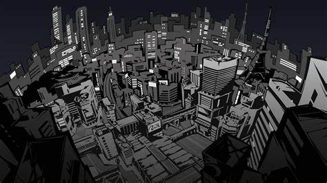

# 🌟 Welcome to My GitHub! 🌟

## 💻 **Programming is my passion**

I take pride in creating *innovative* and *efficient* solutions. Whether it's a small script or a full-fledged application, I enjoy tackling challenges and making ideas come to life. Some of my projects include:

- A **database** that stores character information linked to a **C++ game** I've developed.
- A **fighting game** entirely built from scratch with **C++**
- A **portfolio** that beautifully displays my work and skills

## 🚀 **Always Be Coding (ABC)**

I live by the mindset of continuous improvement. There's always room to grow, and I'm always on the lookout for new opportunities to expand my skill set. I'm passionate about:

- Collaborating with dynamic teams
- Leveraging my skills to make a meaningful impact
- Tackling new challenges and contributing to the community

## 📬 **Let's Connect!**

For business-related inquiries, feel free to contact me directly at:

**jakennik01@gmail.com**

And for fun, here's a trailer to the **game** I've built entirely on **C++** from scratch:

https://youtu.be/Tdyt_Ypg8g0?si=yp3By7Odlnnp8h7_/0.jpg

